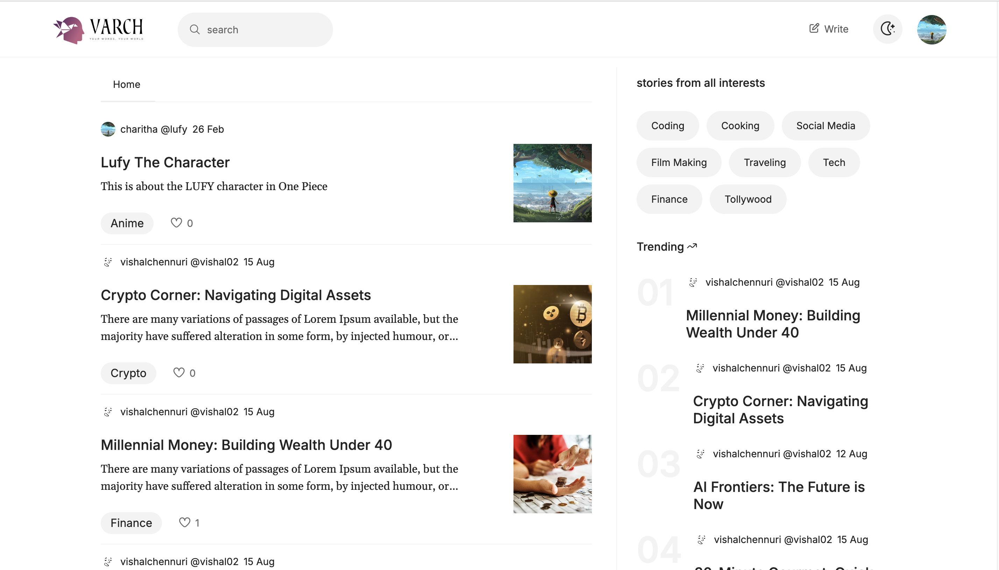
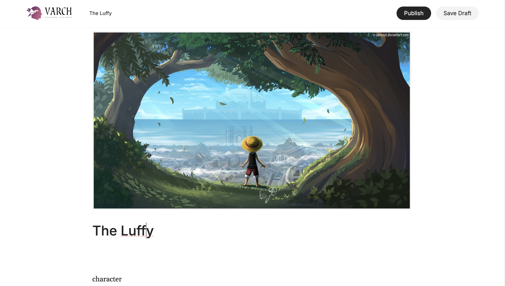
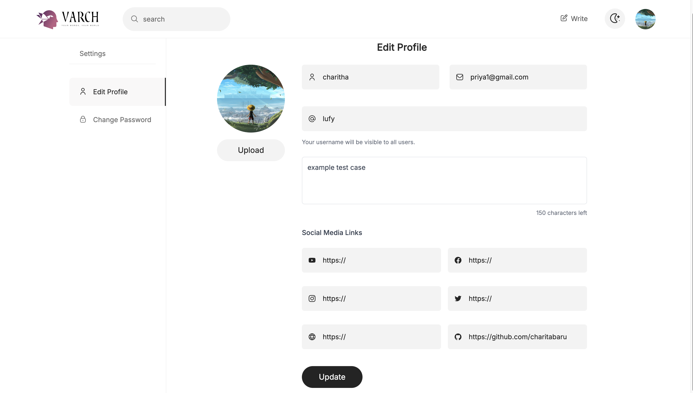
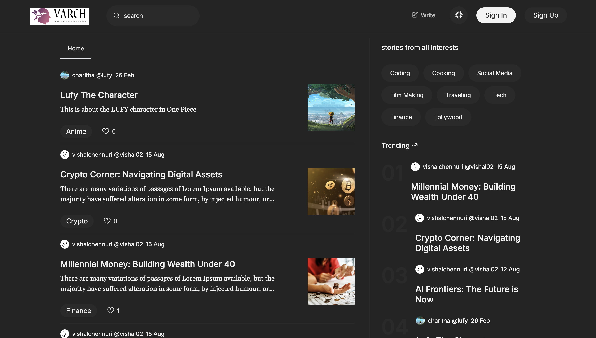
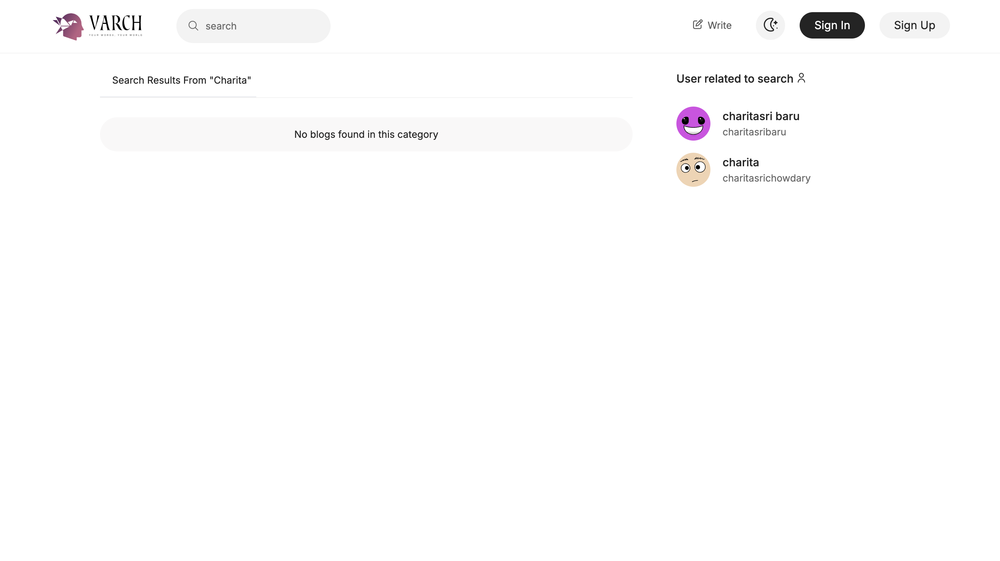

# ✍️ BlogSphere - MERN Stack Blogging Platform

BlogSphere is a modern blogging website built with the MERN stack (MongoDB, Express.js, React, Node.js) and styled with Tailwind CSS. It offers a seamless experience for creating, managing, and exploring blogs with a sleek, responsive UI.

## 🌟 Features

- **Secure Authentication**: Login/signup with JWT tokens  
- **Blog Search & Filter**: Dynamic search bar for posts  
- **Trending Blogs**: Showcases popular content  
- **Full CRUD Operations**: Create, read, update, delete blogs  
- ****Dark Mode****: Toggle between light and dark themes  
- **Responsive Design**: Tailwind-powered UI for all devices  

## 📸 Screenshots

<div align="center">
  <table>
    <tr>
      <th>Homepage</th>
      <th>Create Blog</th>
      <th>Edit Profile</th>
    </tr>
    <tr>
      <td></td>
      <td></td>
      <td></td>
    </tr>
    <tr>
      <th>Sign In</th>
      <th>Dark Mode</th>
      <th>Search Bar</th>
    </tr>
    <tr>
      <td></td>
      <td></td>
      <td></td>
    </tr>
  </table>
</div>

## 🛠️ Tech Stack

### Frontend
- **React**: Dynamic, component-based UI  
- **Tailwind CSS**: Utility-first styling  
- **Components**: Reusable React elements  

### Backend
- **Node.js & Express.js**: RESTful API for blog operations  
- **MongoDB**: Database for users and posts  
- **JWT**: Secure authentication  

### Key Dependencies
```json
{
  "client": {
    "react": "^18.2.0",
    "tailwindcss": "^3.3.0",
    "axios": "^1.6.0"
  },
  "server": {
    "express": "^4.18.2",
    "mongoose": "^8.0.0",
    "jsonwebtoken": "^9.0.0"
  }
}
```

## 🚀 Getting Started

- Run BlogSphere locally with these steps:
  
1.Clone the Repository  
```bash
git clone https://github.com/charitabaru/blogging-website.git
```

2.Navigate to the Project Directory  
```bash
cd blogging-website
```

3.Install Dependencies  
```bash
cd client && npm install
cd ../server && npm install
```

4.Configure Environment Variables
- Create a .env file in server/ with:  
```bash
MONGO_URI=your_mongodb_uri
JWT_SECRET=your_secret_key
```

5.Run the Application  
```bash
cd server && nodemon || node server.js
cd client && npm run dev
```


## 💡 Usage

1.**First Launch**
- Sign in or sign up  
- Browse trending blogs on the homepage
2.**Create a Blog**
- Click "write" on navbar to write and publish  
- Toggle dark mode for comfort
3.**Manage Posts**
- Search for blogs  
- Edit blog option if user is admin

  
## 🔧 Configuration

- `server/config/db.js`: MongoDB setup  
- `client/tailwind.config.js`: Tailwind styles  
- `server/models/`: Data schemas

  
## 🤝 Contributing

1.Fork the repo  
2.Create a branch: git checkout -b feature/CoolFeature  
3.Commit changes: git commit -m 'Add new feature'  
4.Push: git push origin feature/CoolFeature  
5.Open a Pull Request


## 📈 Future Enhancements

- Rich text editor for blog writing  
- Blog categories and tags  
- Comment moderation tools  
- User follower system

## 🙏 Acknowledgments
- MERN stack community for inspiration  
- Tailwind CSS for design utilities  
- Friends for testing and feedback


<p align="center">Made with ❤️ by Charita Chowdary</p>
